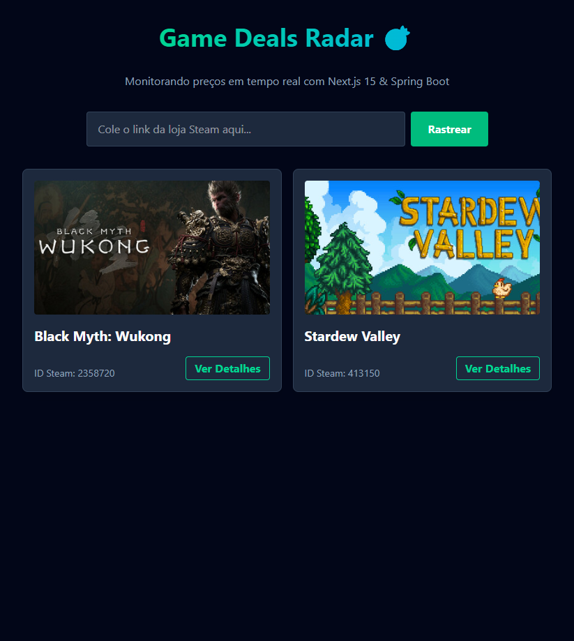

# 🎯 Game Deals Radar

[Leia este documento em Português](README-pt.md)

> Real-time Steam game price monitoring built with Java Spring Boot and Next.js.

## 📸 Preview

  

## 💻 About the Project

**Game Deals Radar** is a Full Stack application designed to help gamers save money. The system allows users to register Steam game URLs, track their current prices via Web Scraping, and maintain a value history.

The technical highlight is automation: a backend **Scheduler** periodically checks all registered games, updating the history without manual intervention, laying the groundwork for a future promotion alert system.

## 🚀 Technologies Used

### Backend (RESTful API)

- **Java 21 & Spring Boot 3**: Application Core.
- **Jsoup**: For Web Scraping Steam store data.
- **Spring Scheduler**: For recurring task automation (price updates).
- **Hibernate/JPA**: Data persistence.
- **PostgreSQL**: Relational database (Hosted on Neon/Serverless).
- **Docker**: Application containerization for deployment.

### Frontend

- **Next.js 15 (React)**: Modern framework for rendering and routing.
- **TypeScript**: Static typing for code safety.
- **Tailwind CSS**: Responsive styling.
- **Recharts**: Data visualization (Price history chart).

### Infrastructure & Deploy

- **Render**: Backend hosting (Docker Container).
- **Vercel**: Frontend hosting.
- **Neon**: Serverless Postgres Database.

## ⚙️ Architecture and Features

1. **Smart Registration:** The user inputs only the Steam link. The Backend scrapes the data, extracts title, image, ID, and current price, and saves it to the database.
2. **Continuous Monitoring:** A scheduled Job (`@Scheduled`) runs periodically in the background, checking for price changes in monitored games.
3. **Price History:** Every variation is saved in a history table, enabling the generation of trend charts.

## 🛠️ How to Run Locally

### Prerequisites

- Java 21+
- Maven
- Node.js 18+
- Docker (Optional, but recommended for the Database)

### 1. Backend

    # Clone the repository
    git clone https://github.com/paulorag/gameDealsRadar.git

    # Enter the backend directory
    cd radar

    # Configure environment variables in application.properties or via terminal
    # Example: DB_URL, DB_USERNAME, DB_PASSWORD

    # Run the project
    mvn spring-boot:run

### 2. Frontend

    # Enter the frontend directory
    cd web

    # Install dependencies
    npm install

    # Create a .env.local file with the backend URL
    # NEXT_PUBLIC_API_URL=http://localhost:8080

    # Run the development server
    npm run dev

## 🗺️ Roadmap

This project is in constant evolution. Upcoming features include:

- [ ] **Alert System:** Discord Webhook integration to notify when prices drop.
- [ ] **Authentication:** User login for private wishlists.
- [ ] **Store Comparator:** Support for Epic Games and Nuuvem.
- [ ] **Dashboard:** Advanced savings statistics.

## 🤝 Contribution

Suggestions and pull requests are welcome! Feel free to open an issue if you find any bugs or have ideas for improvements.

---

Developed by [Paulo Roberto](https://github.com/paulorag)
