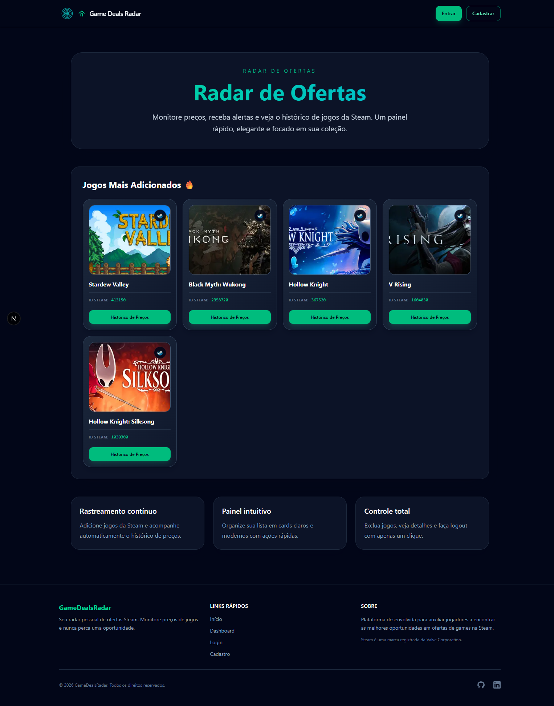

# 🎯 Game Deals Radar

[Leia este documento em Português](README-pt.md)

> Real-time Steam game price monitoring built with Java Spring Boot and Next.js.

## 📸 Preview

  

## 💻 About the Project

**Game Deals Radar** is a Full Stack application designed to help gamers save money. The system allows users to register Steam game URLs, track their current prices via Web Scraping, and maintain a value history.

The technical highlight is automation: a backend **Scheduler** periodically checks all registered games, updating the history without manual intervention, laying the groundwork for a future promotion alert system.

## 🚀 Technologies Used

### Backend (RESTful API)

- **Java 21 & Spring Boot 3**: Application Core.
- **Jsoup**: For Web Scraping Steam store data.
- **Spring Scheduler**: For recurring task automation (price updates).
- **Hibernate/JPA**: Data persistence.
- **PostgreSQL**: Relational database (Hosted on Neon/Serverless).
- **Docker**: Application containerization for deployment.

### Frontend

- **Next.js 15 (React)**: Modern framework for rendering and routing.
- **TypeScript**: Static typing for code safety.
- **Tailwind CSS**: Responsive styling with v4 canonical classes.
- **Recharts**: Data visualization (Price history chart).
- **React Hooks**: State management with `useState`, `useEffect`, `useContext`.
- **Custom Components**: Header, Footer, Notifications, Price Charts, Game Lists.

### Frontend Components

- **Header**: Navigation bar with authentication status.
- **Footer**: Brand information, quick links, and social media integration (GitHub, LinkedIn).
- **Add Game Input**: Form for submitting Steam game URLs with validation.
- **Game List**: Grid display of tracked games with price data.
- **Price Chart**: Interactive charts showing price history trends.
- **Notifications**: Toast notifications for user feedback (success, error, warning).
- **Authentication Forms**: Login and registration with security tokens.
- **Responsive Design**: Mobile-first approach with Tailwind CSS breakpoints.

### Infrastructure & Deploy

- **Render**: Backend hosting (Docker Container).
- **Vercel**: Frontend hosting.
- **Neon**: Serverless Postgres Database.

## ⚙️ Architecture and Features

### Core Features

1. **Smart Registration:** The user inputs only the Steam link. The Backend scrapes the data, extracts title, image, ID, and current price, and saves it to the database.
2. **Continuous Monitoring:** A scheduled Job (`@Scheduled`) runs periodically in the background, checking for price changes in monitored games.
3. **Price History:** Every variation is saved in a history table, enabling the generation of trend charts.
4. **User Dashboard:** Personalized dashboard showing all tracked games and their current prices.
5. **Popular Games Section:** Displays most-tracked games across the platform.
6. **Real-time Price Charts:** Interactive charts powered by Recharts to visualize price trends over time.

### UI/UX Features

- **Responsive Design:** Mobile-first approach with support for all screen sizes.
- **Toast Notifications:** User-friendly feedback system for all actions (add, delete, error).
- **Authentication Flow:** Secure login/signup with JWT token management.
- **Loading States:** Skeleton loaders and spinners for better user experience.
- **Interactive Buttons:** Hover effects and state management for all interactive elements.
- **Dark Theme:** Modern dark interface with emerald accent colors.

## 🛠️ How to Run Locally

### Prerequisites

- Java 21+
- Maven
- Node.js 18+
- Docker (Optional, but recommended for the Database)

### 1. Backend

    # Clone the repository
    git clone https://github.com/paulorag/gameDealsRadar.git

    # Enter the backend directory
    cd radar

    # Configure environment variables in application.properties or via terminal
    # Example: DB_URL, DB_USERNAME, DB_PASSWORD

    # Run the project
    mvn spring-boot:run

### 2. Frontend

    # Enter the frontend directory
    cd web

    # Install dependencies
    npm install

    # Create a .env.local file with the backend URL
    # NEXT_PUBLIC_API_URL=http://localhost:8080

    # Run the development server
    npm run dev

## 🗺️ Roadmap

### ✅ Completed Features

- [x] **Authentication System:** User login and signup with JWT token management.
- [x] **User Dashboard:** Personalized dashboard for tracking games and prices.
- [x] **Price History Charts:** Interactive charts with Recharts for visualizing price trends.
- [x] **Footer Component:** Brand information, quick links, and social media integration.
- [x] **Toast Notifications:** Real-time feedback system for user actions.
- [x] **Responsive Design:** Full mobile-first responsive UI with Tailwind CSS.
- [x] **Popular Games Section:** Display most-tracked games on the platform.

### 🚧 In Progress / Planned Features

- [ ] **Alert System:** Discord Webhook integration to notify users when prices drop below targets.
- [ ] **Email Notifications:** Alternative notification method via email alerts.
- [ ] **Store Comparator:** Support for Epic Games and Nuuvem price comparisons.
- [ ] **Advanced Dashboard:** Detailed savings statistics and spending insights.
- [ ] **Wishlist Sharing:** Share game wishlists with other users.
- [ ] **Price Predictions:** ML-based price trend predictions.
- [ ] **Dark/Light Theme Toggle:** User preference for interface theme.

This project is in constant evolution. Suggestions and contributions are welcome!

## 🤝 Contribution

Suggestions and pull requests are welcome! Feel free to open an issue if you find any bugs or have ideas for improvements.

---

Developed by [Paulo Roberto](https://github.com/paulorag)
